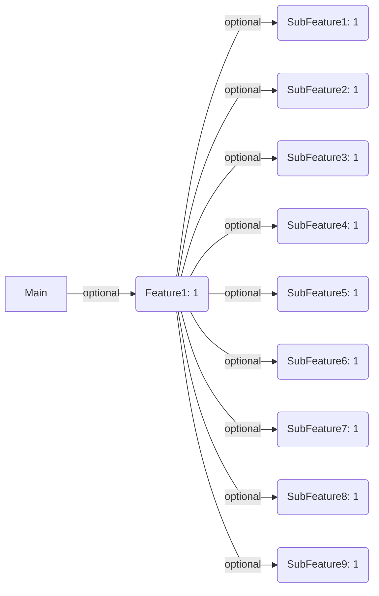

```mermaid
%%{ init : { "theme" : "default", "flowchart" : { "curve" : "monotoneY" }}}%%
graph LR
    Feature1 -- optional --> SubFeature1
    Feature1 -- optional --> SubFeature2
    Feature1 -- optional --> SubFeature3
    Feature1 -- optional --> SubFeature4
    Feature1 -- optional --> SubFeature5
    Feature1 -- optional --> SubFeature6
    Feature1 -- optional --> SubFeature7
    Feature1 -- optional --> SubFeature8
    Feature1 -- optional --> SubFeature9
    Main -- optional --> Feature1

    Feature1(Feature1: 1)
    SubFeature1(SubFeature1: 1)
    SubFeature2(SubFeature2: 1)
    SubFeature3(SubFeature3: 1)
    SubFeature4(SubFeature4: 1)
    SubFeature5(SubFeature5: 1)
    SubFeature6(SubFeature6: 1)
    SubFeature7(SubFeature7: 1)
    SubFeature8(SubFeature8: 1)
    SubFeature9(SubFeature9: 1)
```